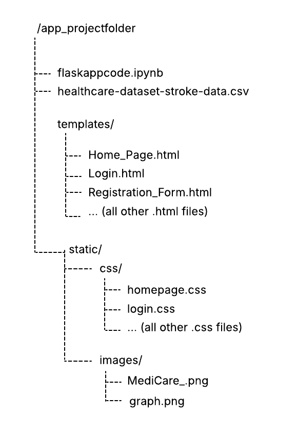

# COM7033 Assessment 1: Hospital Stroke Analytics Application


## Project Overview
I created a web-based application about stroke prediction analytics for a hospital. The application is intended for use by doctors to assist the recording, management and analysis of patient data to predict the likelihood of a stroke and assist in preventive healthcare. 

## Generative AI Statement
This assignment did not use generative AI for the purposes of completing the assignment.

## System Functionality
My web application is a Role-Based Access (RBAC) system where functionalities are strictly divided by two types of users: Administrators (admins) and Doctors. This is to separate the actions that these users can take to ensure secure data management.

### Administrators (Admins) 
 This user have the authority to view all registered doctors. They can also update sensitive doctor information such as their (First Name, Last Name, and Email address). They can also perform password resets securely using the “Edit User” button and interface. Additionally, they have the power to delete obsolete doctor accounts via the admin dashboard options.

### Doctors  
 This user can browse at the list of patients stored in a MongoDB database. As there are over 1000 patients in the database, I implemented a pagination feature for efficient data retrieval. With pagination, a doctor can view 20 records at a time and click a ‘next’ button to view the next 20 records of patients. There is also search feature so doctors can search for specific patients by ID. For example, if a doctor types ‘99’ into the search box and submits, patients with an ID containing ‘99’ will show and the doctor can navigate through these patients with pagination.  
Doctors can create detailed medical reports including details of notes, stroke prediction, and treatment, which are stored in a MongoDB database. The system automatically assigns a sequential, unique Report ID (for example: MR-102) to every new record.  
Additionally, doctors can also view a history of reports that they have created and they possess the authority to edit their own reports or delete reports in case of error. They are restricted from modifying reports created by other doctors.

## Technical & Security Features  
 The application incorporates secure programming techniques, security best practices, and secure architecture design to ensure a robust system against potential security threats to sensitive data. Additionally, technical features are implemented to ensure secure data management and efficient data retrieval.

### Hybrid Database Architecture  
SQLite (Relational) database is used for rigid data such as the patient and user data. This is to enforce strict schema for critical login data and sensitive patient data.  
MongoDB (NoSQL) is used for medical records to fllow flexibilty in storing varied report data. It can also handle large volumes of text (such as for doctor notes) efficienty.

### Input Sanitisation & Validation
All registration forms (including form for doctors to register, and form for doctors to create new medical records) utilize server-side regex validation to prevent potential injection attacks and invalid or bad data entry. For the registration form for new doctors, new doctors are automatically assigned the role ‘doctor’ to prevent them being registered as an admin and adopting admin privileges in the system.  

### Secure Session Handling
Upon logging into the system, session cookies are enabled to track logged-in users, The session is cleared automatically upon logout to prevent unauthorized access.

### Password Encryption
All user passwords are hashed using the method pbkdf:sha256 before storage. This ensures that raw passwords are never exposed in the database. 

### Role-Based Access Control (RBAC):
Admins and Doctors are differentiated by their 'role' stored in the database, so that admins cannot see patient data, and so doctors cannot tamper with credentials of other doctors.

### Parameterized Queries
For queries to the database, the '?' placeholder is used to prevent SQL injection attacks, ensuring that cyber attackers cannot manipulate database commands.

### Pagination and Efficient Search
As there are over 1000 patient records, a pagination feature is implemented in the 'View Patients' page for doctors so they can navigate through pages of 20 patient records at a time. Doctors can also search for patient records by Patient ID to look for specific patients faster. 

### Unit Testing
15 unit tests were implemented across different features of the application to ensure that they are all working as intended and are robust against bad data entry and other potential security threats such as SQL injection. 

## Application Installation Instructions & User Guide
### 1. Prerequisites
Before running the application, ensure the following software is installed along with having a stable, active internet connection:
- Python 3.x 
- Jupter Notebook

### 2. Folder Structure & File Setup 
For the application to work as intended set up the required project folder set up/hierarchy in the image below. This is so that Flask can locate the html templates and CSS files.
  
Note: The hospitaldata.db is automatically created when the main application code in 'flaskappcode.ipynb' is run. However I have also included a copy of 'hospitaldata.db' in the repository to download and place in '/app_projectfolder' if preferred. Either methods will work. 
Download the 'flaskappcode.ipynb', csv file, and all of the html, css, and png files from the 'app_projectfolder' folder in this repository to place in your folder set up. 

### 3. Library Installation
There are a number of libraries used and imported in the code to make the application work. These are the library imports included in the Jupyter Notebook:   
```python
from flask import Flask, render_template, request, redirect, url_for, flash, session, redirect
import logging, re, os
from datetime import datetime
from werkzeug.security import generate_password_hash, check_password_hash 
import sqlite3
import csv
import pymongo
import math  
```
Ensure that you pip install all the libraries included in this code chunk if you haven't already installed them before. 

### 4. Database Configuration
No set up is required, the SQLite database ‘hospitaldata.db’ is already created, however, if for any reason the database was accidentally deleted, the application code automatically generates a hospitaldata.db and populates it with admins and doctor user accounts, and patient data from the csv file upon the first run. The 'hospitaldata.db' is also in the repository for download as well if preferred.
The application automatically connects to a MongoDB Atlas cloud cluster and the connection string is implemented in the code. The database IP access is set to 0.0.0.0/0 so no firewall configuration is needed.  

### 5. Running the Application
1.  Launch Anaconda Navigator and open Jupyter Notebook.
2.	Navigate to the project folder and open flaskappcode.ipynb
3.	Go the menu bar, select Cell, and click Run All.
4.	Scroll to the penultimate chunk to see the unit test outputs, and the last chunk to see an output to indicate that the server is running.
5.	Click the link [http://127.0.0.1:5000](http://127.0.0.1:5000) to open the web application in your browser.

### 6. Testing with Existing Login Credentials  
The following login credentials created in the code are available to test the application system:  
  
#### Admin:
  username: admin1  
  password: Admin123!

#### Doctor:  
 username: hbrown  
 password: Doctor123!

 Other pre-seeded admin and doctor credentials are also avaiable in the Jupyter notebook code to test the system with other pre-existing users.

### 7. Troubleshooting
- Template Not Found: Ensure HTML files are strictly inside the templates/ folder and that CSS files are strictly in the css/ folder.  
- SQL Database Locked: Ensure that no other notebooks or database viewer such as DB Browser is keeping ‘hospitaldata.db’ open if there are any SQLite errors.  
- MongoDB Connection Error: Ensure that you have a stable, active internet connection as the database for the medical reports collection is stored in the cloud.

## Application Design and Implementation Changes
Due to time constraints, not all of the user stories and design were implemented in the application but were still included in the project design and development to demonstrate my understanding of system architecture and secure software development practices.

## Other Files in the Repository
As I designed the application following the stages of the Secure Software Development Lifecycle, I have also included files from the Planning & Requirements phase, and Secure Design phase as part of my development of the project.

### UserStories_UseCases_Updated.pdf
This file identifies implemented and potention users of the application, and included detailed user stories.

### ThreatModelling_RiskAssessment.pdf
Threat Modelling & Risk Assessment file: this file includes the functional requirements and security requirements of the application, STRIDE threat table & risk register, and a table mapping security requirements to GDPR and Compliance needs.  

### layered_architecture.pdf & Layered_Architecture_Model.Updated.pdf
This file consists of Layered Architecture design for the application. There are justifications for using this type of design architecture, mapping each layer of the architecture to functions of the application and key security controls. I also designed a layered architecture model diagram, defined a data flow protection table, a controls justification matrix, and RBAC & Least Priviledge table.  

### DataFlowDiagrams.png, DFDwithRBAC.png & trustboundary_justifications.pdf  
These files consist of data flow diagrams and justifications for trust boundaries in the diagrams.


 


